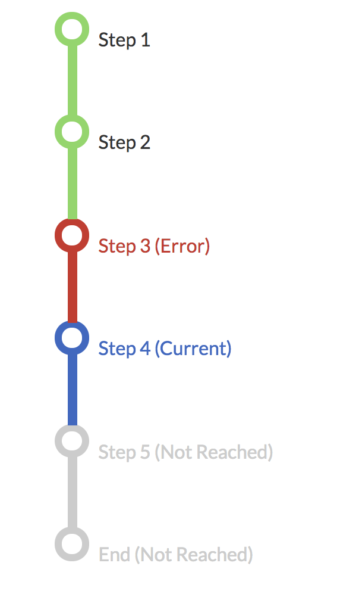

# waypoint-navigation

This is just a HTML and CSS snippet that I put together for a simple vertical
waypoint navigation.

## Usage

Since it's just simple HTML and CSS, this can be dropped into nearly any web
project.

Just modify the styles as necessary to match with your application theme.

## Screenshot

